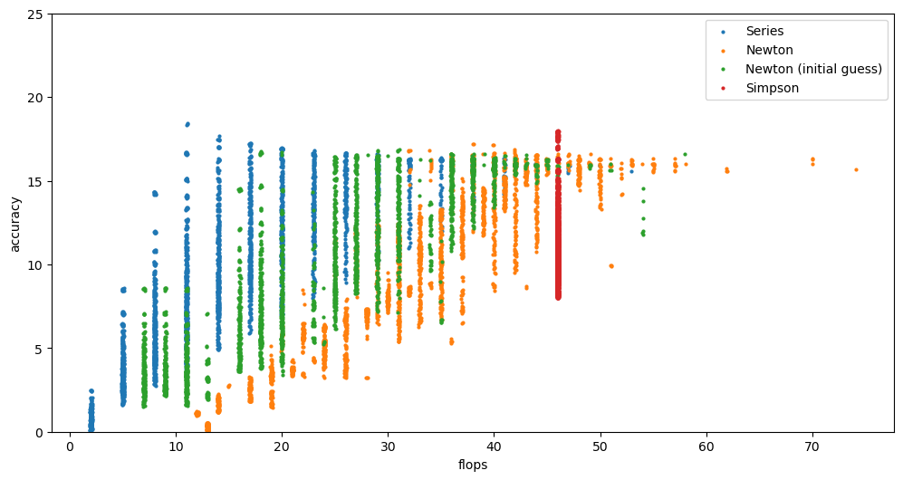

# numerical-investigation
Investigating efficient methods of numerical computation

- Series approximation for Log(1 + x)
- Newton-Raphson method for Exp(t) - x
- Simpson rule integration for 1/t

Achievable accuracy as a function of the number of floating point operations expended. 

